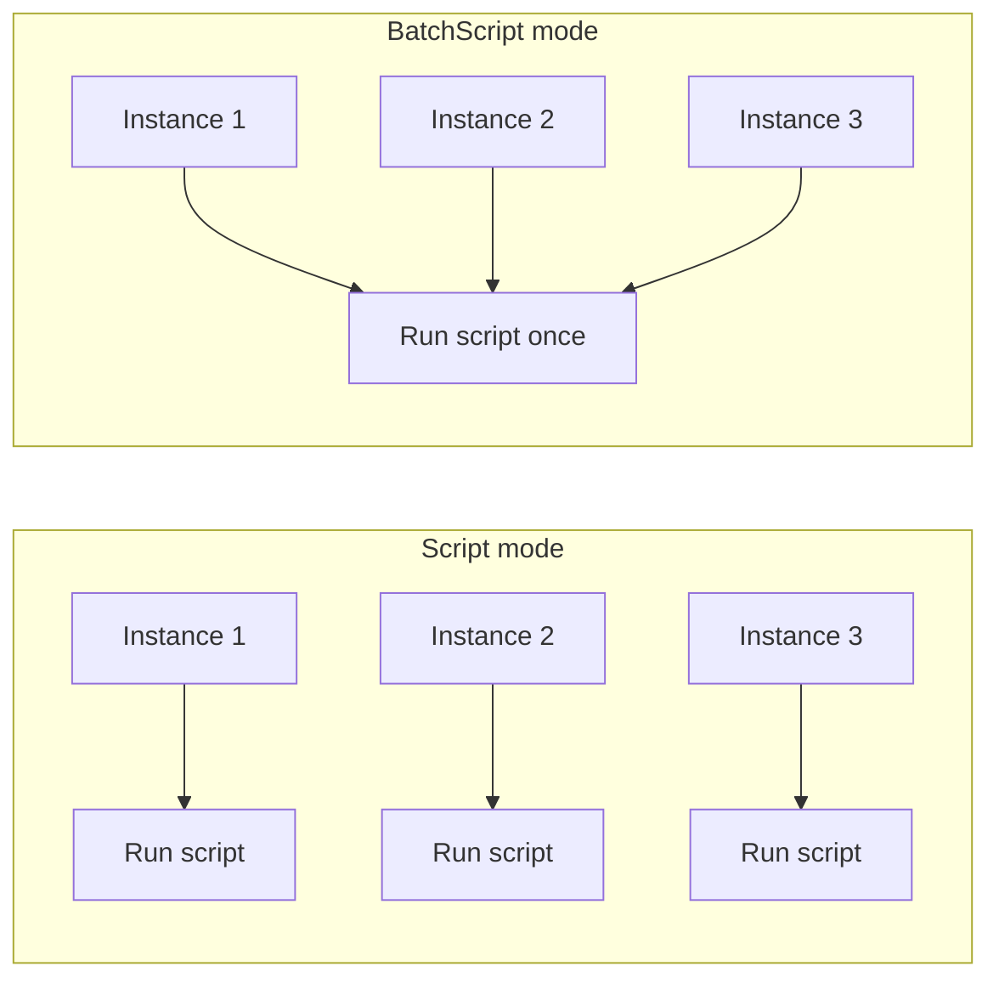

# Collection Modes

DataSources collect metrics using built-in methods (SNMP, WMI, HTTP, etc.) or **scripted** collection (Groovy, PowerShell, external). When using scripts, you choose between two collection modes: **Script** and **BatchScript**.

## When to use scripted collection

Built-in methods are sufficient for most custom DataSources. Use scripted collection when you need to:

- Execute an arbitrary program and capture its output
- Call an HTTP API that requires session-based authentication before polling
- Aggregate data from multiple SNMP nodes or WMI classes into one DataSource
- Measure process execution time or exit codes

For non-numeric, text-based event data, consider a [LogSource](../module-types/logsource.md) or [EventSource](../module-types/eventsource.md) instead.

## Script collection types

LogicMonitor supports three script execution types:

| Type | Platform | Best for |
|------|----------|----------|
| **Embedded Groovy** | All Collectors | Cross-platform; broad API access (SNMP, HTTP, JDBC, JSCH, etc.) |
| **Embedded PowerShell** | Windows Collectors only | Windows-native cmdlets, WMI, WinRM |
| **External script** | Collector OS dependent | Any language or binary; runs as separate process |

---

## Script mode vs BatchScript mode

Script-based collection operates in two modes. LogicMonitor refers to these as **SCRIPT** and **BATCHSCRIPT**.



### Script mode (SCRIPT)

The collection script runs **once per instance** at each collection interval.

- A DataSource with 5 discovered instances runs the script **5 times** per poll
- Each run is independent
- Best for: few instances, or when each run needs isolated per-instance context
- You **can** use `instanceProps.get()` for instance-specific properties

**Output example** (one instance per script run):

```
key1=value1
key2=value2
key3=value3
```

Create one datapoint per key. Use the **Multi-line key-value pairs** post-processor (or equivalent) to map keys to datapoint values.

### BatchScript mode (BATCHSCRIPT)

The collection script runs **once per device** per collection interval, regardless of instance count.

- A DataSource with 50 instances still runs the script **once** per poll
- Best for: many instances, or devices that don't support per-instance SNMP/API queries
- More efficient at scale
- Requires **Multi-Instance** and **Active Discovery** enabled

**Output example** (all instances in one run):

```
disk1.iops=9024
disk1.throughput=563
disk2.iops=4325
disk2.throughput=452
```

Datapoint keys in the module definition use the `##WILDVALUE##` token — **not** inside the script itself:

```
##WILDVALUE##.iops
##WILDVALUE##.throughput
```

LogicMonitor replaces `##WILDVALUE##` with each instance name (`disk1`, `disk2`, etc.) during post-processing.

### BatchScript JSON output

Alternatively, return structured JSON:

```json
{
  "data": {
    "instance1": {
      "values": {
        "key1": 100,
        "key2": 200
      }
    },
    "instance2": {
      "values": {
        "key1": 150,
        "key2": 250
      }
    }
  }
}
```

Use the **JSON/BSON object** post-processor. Datapoint keys follow this pattern:

```
data.##WILDVALUE##.values.key1
data.##WILDVALUE##.values.key2
```

---

## Choosing between Script and BatchScript

| Scenario | Recommended mode |
|----------|------------------|
| 1–5 instances | Script |
| 10+ instances | BatchScript |
| Per-instance connection overhead is high | BatchScript |
| Need `instanceProps.get()` in the script | Script |
| Device API returns all instances in one call | BatchScript |
| Single-instance DataSource | Script (BatchScript requires multi-instance) |

---

## BatchScript scripting constraints

Because BatchScript runs once per device:

- **Cannot** use `instanceProps.get()` for instance-specific properties
- **Cannot** use `##WILDVALUE##` or `##WILDALIAS##` tokens inside the script body
- **Can** iterate all instances via `datasourceinstanceProps` in Groovy:

```groovy
def listOfWildValues = datasourceinstanceProps.values().collect { it.wildvalue }

datasourceinstanceProps.each { instance, instanceProperties ->
    instanceProperties.each { prop ->
        def wildValue = prop.wildvalue
        // Generate metrics for each instance
    }
}
```

### Wildvalue characters in BatchScript output

If `##WILDVALUE##` contains unsupported characters (`:`, `#`, `\`, spaces), the datapoint returns **NoData**.

**Recommendation:** Replace invalid characters with underscores (`_`) or dashes (`-`) in both Active Discovery scripts and collection script output.

### Timeouts

- `collector.batchscript.timeout` in `agent.conf` applies to BatchScript only
- PowerShell scripts run in a separate process with a fixed, non-configurable timeout
- For large PowerShell output, use `Write-Output` instead of `Write-Host` to reduce timeout risk

---

## Configuring a BatchScript datapoint

1. Navigate to **Modules** and open (or create) your DataSource
2. Set **Collection Method** to **BatchScript**
3. Enable **Multi-Instance** and **Active Discovery**
4. Add a **Normal Datapoint**:
   - **Datapoint source:** Content the script writes to standard output
   - **Interpret output with:** Multi-line key-value pairs (or JSON/BSON object)
   - **Key:** `##WILDVALUE##.yourDatapointName`

---

## General scripting workflow

1. Write code that retrieves the numeric metrics you need
2. Print metrics to stdout (key-value pairs or JSON)
3. Create a datapoint for each metric with the appropriate post-processor
4. Set alert thresholds and graphs on the datapoints

Scripts should return exit code **0** on success.

---

## Related concepts

- [Active Discovery](active-discovery.md) — required for multi-instance BatchScript DataSources
- [Output Formats](output-formats.md) — quick reference for script output syntax

## Official documentation

- [Scripted Data Collection Overview](https://www.logicmonitor.com/support/logicmodules/datasources/data-collection-methods/scripted-data-collection-overview)
- [BatchScript Data Collection](https://www.logicmonitor.com/support/batchscript-data-collection)
